# Checkio - Automated Code Testing Tool

CheckIO is a **test case execution tool** designed for **students and faculty**. It allows users to create test cases, run programs against a specified testcase. The tool provides insights and suggestions for failed test cases, helping users to debug their code efficiently.

This project is developed as part of our **KTU S6 Mini Project**.

---

## 🚀 Features
- **CLI Interface** – Easily run programs against a specified testcase, compile and run in a single command
- **Web Interface** – The admins or faculty can add, view, and evaluate testcases.
- **Error Suggestions** – Provides insights and fixes for faulty programs.
- **Find Seg Faults** - `analyze` gives you where seg faults occur in a C code.
- **Test Case Management** – Create, edit, and delete test cases with ease.

---

## 🛠️ Technology Used
- **Python** – Core logic and backend.
- **Flask** – Web server for API and web-based testing.
- **React** – Frontend for the web interface.
- **SQLite** – Lightweight database for storing test cases.

---

## 🔗 GitHub Repository
[🔗 CheckIO GitHub Repo](https://github.com/fbn776/Checkio)

---

# Installation
1. Clone the repository
    ```bash
    git clone <repo-url>
    ```
    Or download the zip file and extract it.
2. Change the directory to the project folder
    ```bash
    cd <project-folder>
    ```
3. Install the dependencies
    ```bash
    uv pip install -e .
    ```
4. Run the project
    ```bash
    uv run python3 src/main.py
    ```

For a more detailed installation guide, refer to [setup](docs/setup.md).

---

## 🤝 Collaborators
- **Abhiram Ashok** ([@abhi5455](https://github.com/abhi5455))
- **Aysha Naurin** ([@Aysha022](https://github.com/Aysha022)
- **Febin Nelson P** ([@fbn776](https://github.com/fbn776))
- **Sreelakshmi K** ([@SreelakshmiKSudheer](https://github.com/SreelakshmiKSudheer))

---

## 📸 Screenshots

<details>
<summary><strong>💻 Terminal Interface</strong></summary>
- **Checkio commands**

  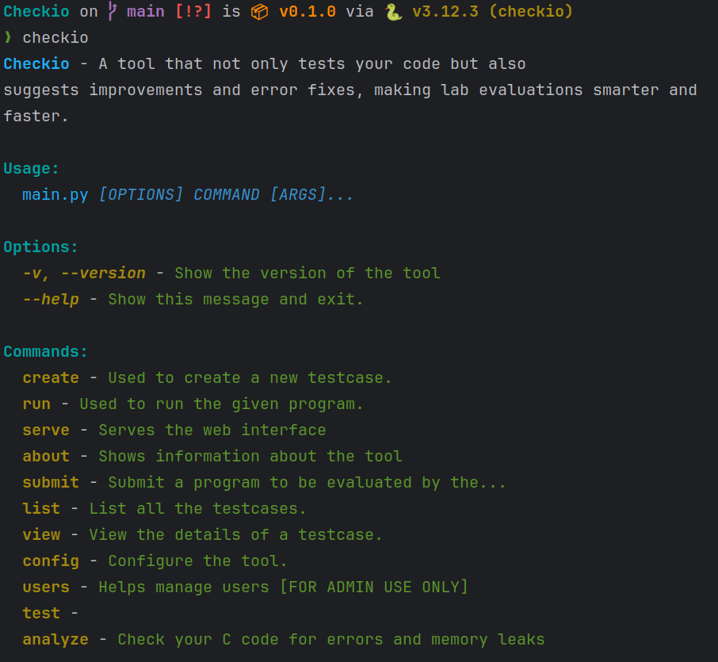

- **Creating a test case from terminal**

  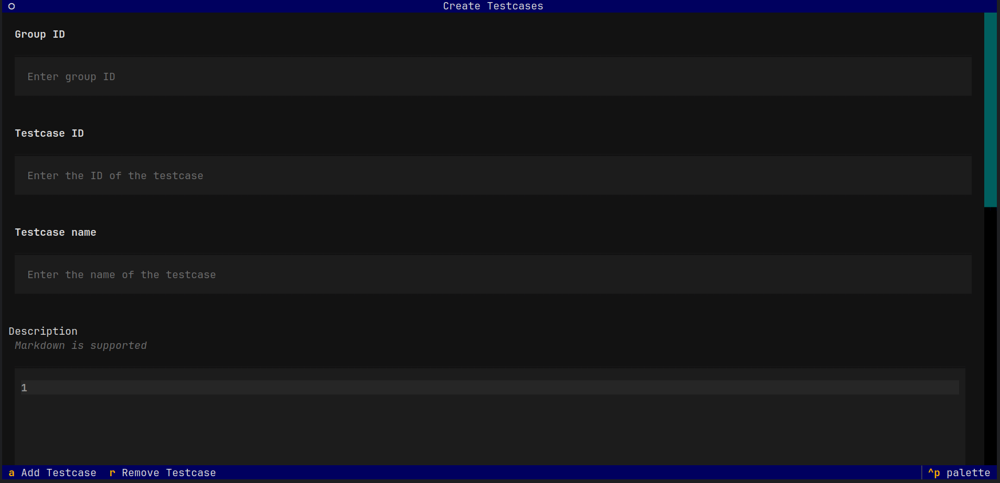

- **Running a C file against test cases**

  
</details>

<details>
<summary><strong>🌐 Web Interface</strong></summary>
- **Homepage - About Checkio**

  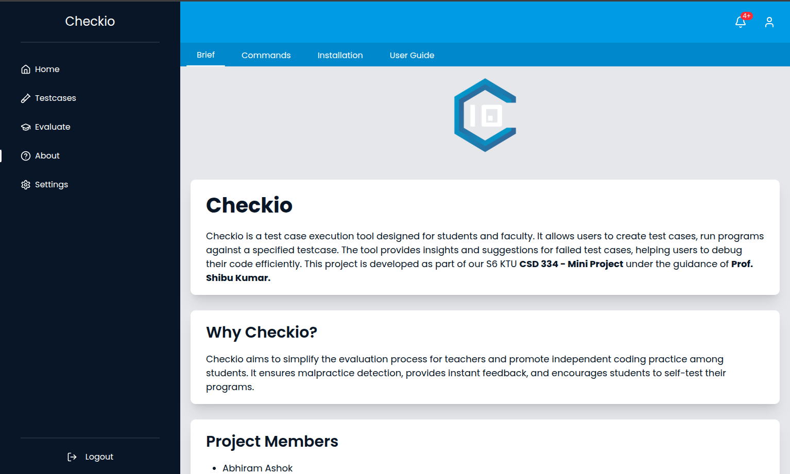

- **Installation Guide Section**

  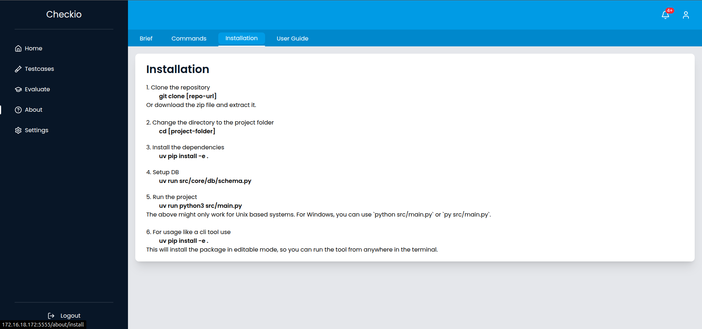

- **User Guide Overview**

  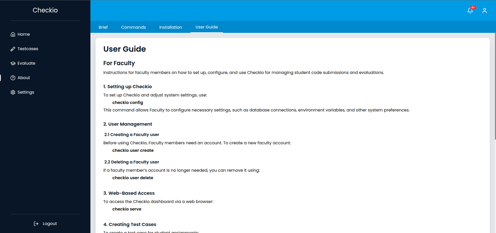

- **Command Reference**

  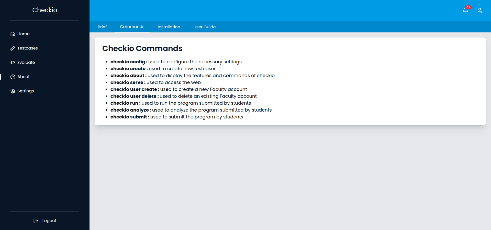
</details>

<details>
<summary><strong>🧪 Web: Creating & Managing Test Cases</strong></summary>

- **Create a new test case**

  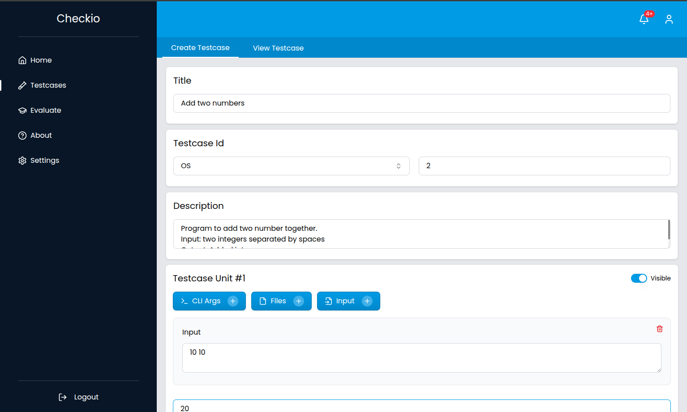

- **View all test cases**

  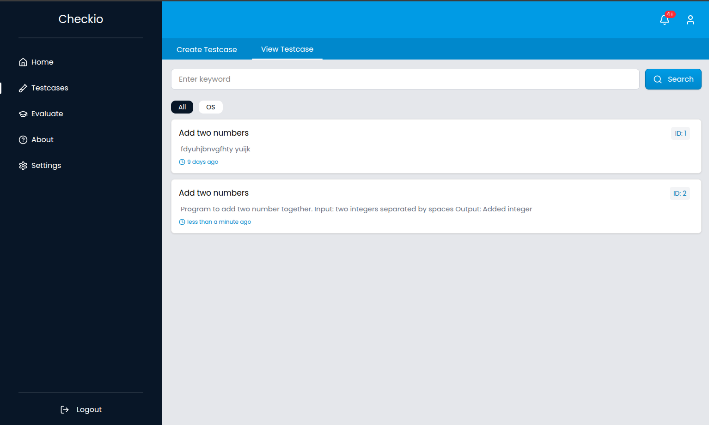

- **Testcase details**

  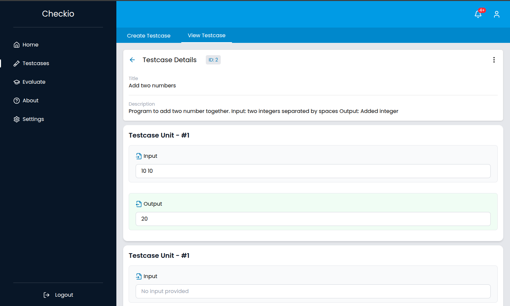

</details>

<details>
<summary><strong>📊 Web: Evaluation & Submissions</strong></summary>

- **Evaluate a submission**

  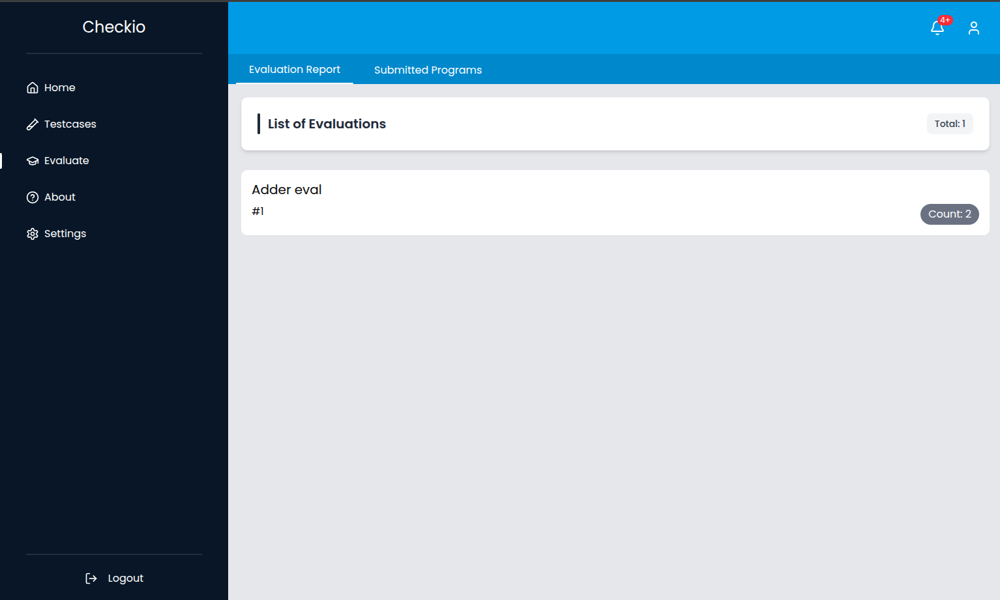

- **Detailed output of evaluation**

  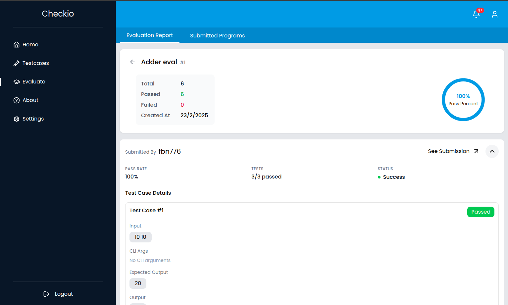

- **View submission details**

  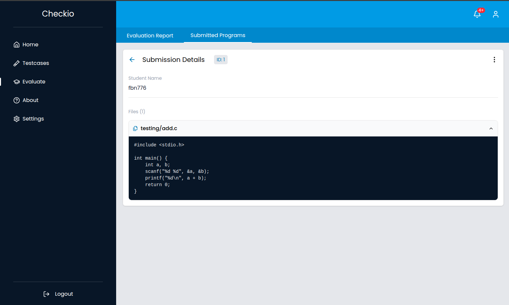

</details>

<details>
<summary><strong>⚙️ Web: Settings</strong></summary>

- **Change app settings from web**

  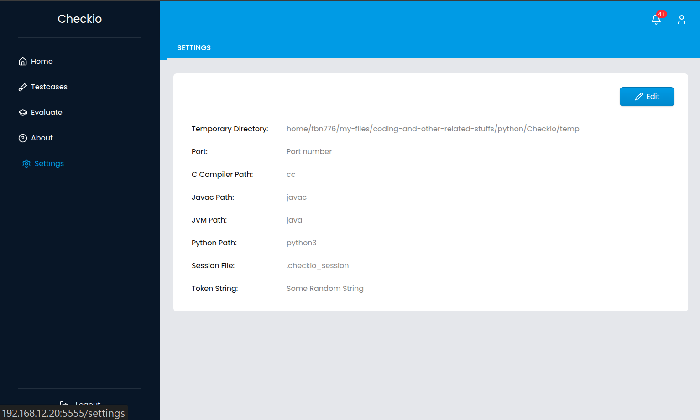

</details>


---

## 📝 Notes
- The project is in **active development**, and contributions are welcome.
- Future plans include **support for multiple programming languages**.
- Bugs or issues? Report them in the **GitHub Issues section**.
